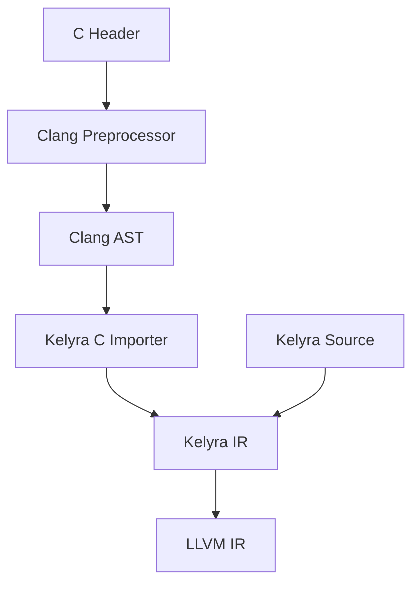

完全赞同。但需要区分一个关键点：

> **Kelyra 应该天然兼容 C 的 ABI、头文件、目标文件和构建生态，而不是成为 C 的语法超集。**

C++ 的生命力很大程度来自 C 生态，但它也因为保留过多 C/C++ 源码兼容性而背负了复杂声明、隐式转换、预处理器等历史问题。Kelyra 应当做到“调用 C 像本语言一样自然”，同时不继承这些问题。

## 一、把 C 互操作定为一级语言能力

Kelyra 应当同时支持以下五个方向：

| 能力       | 目标                          |
| -------- | --------------------------- |
| 导入 C 头文件 | 直接解析 `.h`，不要求人工重写声明         |
| 编译 C 源文件 | 项目中可以直接加入 `.c`              |
| 链接 C 库   | 支持静态库、动态库、系统库和 pkg-config   |
| 导出给 C    | 自动生成 `.h` 和 C ABI 符号        |
| API 封装     | 在原始 C 接口上建立惯用的 Kelyra API     |

理想体验应当是：

```kly
import c "sqlite3.h" as sqlite;

@main
fn main() -> i32 {
    let database: *sqlite.sqlite3;

    let result = sqlite.sqlite3_open(c"database.db", &database);

    if result != sqlite.SQLITE_OK {
        return result;
    }

    sqlite.sqlite3_close(database);

    return 0;
}
```

这里：

* 头文件由 Clang 解析
* C 内容放入独立命名空间
* C 字符串有明确语法
* 原始 C 指针和调用直接使用，正确性由程序员负责
* 不需要 `bindgen`
* 不需要手写几百行 `extern` 声明

Zig 已经证明“C 头文件翻译、C 类型、混合目标文件、导出 C 库”可以成为语言工具链的一部分，而不只是第三方工具。[Zig C interoperability](https://ziglang.org/documentation/master/#C)

## 二、底层采用 Clang，而不是自己解析 C

Kelyra 编译器不应该自己实现 C 预处理器和 C parser。

推荐架构：



由于你本身打算基于 LLVM，这条路线非常自然：

* Clang 负责宏展开
* Clang 负责目标平台数据布局
* Clang 负责 calling convention
* Clang 识别 GCC、MSVC 扩展
* Kelyra 读取 Clang AST 并建立外部声明
* 最终共享 LLVM target triple 和 DataLayout

实现时建议使用 Clang Frontend/LibTooling，而不仅仅依靠正则或简单头文件扫描。[Clang LibTooling](https://clang.llvm.org/docs/LibTooling.html)

这意味着 Kelyra 对某个目标平台的 C 兼容性，本质上可以定义为：

> 对相同 target triple、sysroot、宏定义和编译选项，Kelyra 与同版本 Clang 产生一致的 C ABI。

## 三、C 类型必须独立存在

不能简单地认为 C 的 `long` 就是 Kelyra 的 `i64`。Windows x64 和 Linux x86-64 上的 `long` 大小不同。

建议内置一个 `c` 模块：

| C 类型            | Kelyra 类型    |
| --------------- | ------------ |
| `char`          | `c.char`     |
| `signed char`   | `c.schar`    |
| `unsigned char` | `c.uchar`    |
| `short`         | `c.short`    |
| `int`           | `c.int`      |
| `unsigned int`  | `c.uint`     |
| `long`          | `c.long`     |
| `long long`     | `c.longlong` |
| `size_t`        | `c.size`     |
| `ptrdiff_t`     | `c.ptrdiff`  |
| `_Bool`         | `c.bool`     |
| `wchar_t`       | `c.wchar`    |
| `void*`         | `*void`      |

例如：

```kly
extern "C" fn strlen(text: *c.char) -> c.size;
```

允许显式转换：

```kly
let native_value: c.long = c.cast[c.long](value);
let value64: i64 = cast[i64](native_value);
```

不要在普通 Kelyra 代码中让 `c.long` 与 `i64` 隐式等价。

## 四、C 字符串必须显式

Kelyra 的 `str` 不应该隐式转换为 `char*`，因为 C 字符串涉及：

* NUL 结尾
* 生命周期
* 可变性
* 编码
* 内部 NUL 字符

建议提供 C 字符串字面量：

```kly
let name: *c.char = c"hello";
```

动态字符串使用拥有所有权的类型：

```kly
let path = CString.from_str(user_path)?;
c_api.open(path.ptr());
```

区分：

```kly
str                 // Kelyra UTF-8 字符串视图
String              // Kelyra 拥有的字符串
CString             // 拥有的 NUL 结尾 C 字符串
*c.char             // 原始 C 字符指针
```

不要自动猜测。

## 五、原始层和惯用封装分开

C 接口本身没有足够的信息表达：

* 指针是否允许为空
* 谁拥有内存
* 数组长度是多少
* 返回值是否需要释放
* 回调何时失效
* 函数是否线程安全

导入的原始接口可以直接调用：

```kly
import c "libpng.h" as png;

let image = png.png_create_read_struct(...);
```

用户或工具可以在其上建立惯用包装：

```kly
struct PngReader {
    raw: *png.png_struct,
}

impl Drop for PngReader {
    fn drop(self: *Self) {
        png.png_destroy_read_struct(&self.raw, null, null);
    }
}

impl PngReader {
    pub fn open(path: *Path) -> Result[PngReader, PngError] {
        // 惯用封装
    }
}
```

以后 Kelyra 可以提供 `kly bindgen`，根据注解生成包装：

```kly
@c_wrapper(
    constructor = "png_create_read_struct",
    destructor = "png_destroy_read_struct",
)
struct PngReader;
```

但不能根据函数名擅自推测所有权。

## 六、C 数据布局必须严格兼容

手写 C ABI 类型建议使用：

```kly
@layout(c)
struct Point {
    x: c.int,
    y: c.int,
}

@layout(c)
union Value {
    integer: c.int,
    floating: c.double,
}
```

需要支持：

* `struct`
* `union`
* C enum
* 指定对齐
* `packed`
* 匿名 struct/union
* 位域
* flexible array member
* 不完整类型
* `volatile`
* `_Atomic`
* thread-local storage

不完整类型映射为 opaque：

```c
typedef struct sqlite3 sqlite3;
```

导入后：

```kly
opaque struct sqlite.sqlite3;
```

只能通过指针操作：

```kly
let db: *sqlite.sqlite3;
```

### 位域

C：

```c
struct Flags {
    unsigned read  : 1;
    unsigned write : 1;
    unsigned mode  : 3;
};
```

Kelyra 应允许访问导入字段，但禁止取得位域地址：

```kly
let readable = flags.read;
// &flags.read  编译错误
```

位域布局由 Clang 决定，不能由 Kelyra 自己重新计算。

## 七、调用约定是一等类型信息

建议语法：

```kly
extern "C" fn callback(value: c.int) -> c.int;
extern "system" fn window_proc(...) -> c.long;
extern "stdcall" fn legacy_api(...) -> c.int;
```

函数指针：

```kly
let callback: *extern "C" fn(
    context: *void,
    value: c.int,
) -> c.int;
```

建议支持：

* `C`
* `system`
* `stdcall`
* `fastcall`
* `vectorcall`
* `thiscall`，仅为兼容特定 ABI
* 平台相关 calling convention

`extern "system"` 很重要，它可以在 Windows 上自动选择对应系统 ABI。

## 八、回调函数必须自然

无捕获回调可以直接传给 C：

```kly
extern "C" fn compare(
    lhs: *void,
    rhs: *void,
) -> c.int {
    let a = cast[*i32](lhs);
    let b = cast[*i32](rhs);
    return *a - *b;
}

libc.qsort(data.ptr(), data.len(), sizeof[i32], compare);
```

带状态回调使用常见的 `context` 指针：

```kly
struct CallbackState {
    count: usize,
}

extern "C" fn callback(
    context: *void,
    value: c.int,
) {
    let state = cast[*CallbackState](context);
    state.count += 1;
}
```

捕获闭包不能无条件转换为 C 函数指针，因为闭包通常包含环境对象。以后可以提供显式 trampoline，但不能隐式生成并隐藏生命周期。

## 九、宏需要分级支持

C 宏是最棘手的部分。建议分为四级：

### 1. 对象式常量宏

```c
#define SQLITE_OK 0
#define BUFFER_SIZE 4096
```

直接导入：

```kly
sqlite.SQLITE_OK
sqlite.BUFFER_SIZE
```

### 2. 类型和表达式宏

```c
#define ARRAY_SIZE(x) (sizeof(x) / sizeof((x)[0]))
```

如果能可靠转换，导入为编译期函数或 intrinsic。

### 3. 函数式宏

常见宏可以作为编译器生成的 pseudo-function：

```kly
libc.FD_SET(fd, &set);
```

内部仍由 Clang 处理展开。

### 4. 无法可靠转换的宏

例如依赖 token 拼接、声明生成或复杂条件编译的宏，编译器应当明确报告：

```text
C macro MY_DECLARE cannot be represented in Kelyra.
Generate a C shim with: kly c-shim MY_DECLARE
```

然后生成：

```c
// generated_shim.c
int kelyra_MY_DECLARE_wrapper(...) {
    return MY_DECLARE(...);
}
```

不能为了声称“完全兼容”而悄悄错误翻译宏。

## 十、C 可变参数函数

需要支持：

```kly
libc.printf(c"value = %d\n", value);
```

但必须遵循 C 默认参数提升：

* `float` 提升为 `double`
* 小整数提升为 `int`
* 参数必须是 C ABI 类型
* 格式字符串可以静态检查

建议复用 Clang 的 `format(printf)` 属性信息，在编译期检查：

```kly
libc.printf(c"%s", 42);
// 错误：%s 需要 *c.char，但传入了 i32
```

对于自定义可变参数函数：

```kly
@c_format("printf", format_index = 1, args_index = 2)
extern "C" fn log(format: *c.char, ...) -> c.int;
```

## 十一、Kelyra 导出给 C

Kelyra 库应当能够这样声明：

```kly
@c_export("kelyra_add")
pub extern "C" fn add(a: c.int, b: c.int) -> c.int {
    return a + b;
}
```

构建：

```shell
kly build --library --emit-c-header
```

产生：

```c
#ifndef KELYRA_LIBRARY_H
#define KELYRA_LIBRARY_H

#ifdef __cplusplus
extern "C" {
#endif

int kelyra_add(int a, int b);

#ifdef __cplusplus
}
#endif

#endif
```

必须保证：

* 没有 name mangling
* 可以构建静态库和动态库
* C 用户不需要 Kelyra 编译器
* 无运行时模式下也可以使用
* 自动生成符号可见性声明
* 自动生成 Windows `__declspec(dllexport/dllimport)`

## 十二、禁止 unwind 穿过 C 边界

以下内容不能穿过 `extern "C"`：

* Kelyra panic
* C++ exception
* Kelyra 特有的错误返回机制
* 非局部控制流

建议规则：

```kly
@c_export("process")
extern "C" fn process(input: *Data) -> c.int {
    // panic 默认在边界处 abort
}
```

也可以显式捕获：

```kly
@c_export("process")
@panic_to_error(-1)
extern "C" fn process(input: *Data) -> c.int {
    // panic 转换为 -1
}
```

`Result[T,E]` 不能直接出现在 C ABI 中：

```kly
// 编译错误
extern "C" fn load() -> Result[Data, Error];
```

必须转换为 C 可表达的形式：

```kly
extern "C" fn load(
    output: *Data,
) -> c.int;
```

## 十三、构建系统也必须理解 C

`kelyra.toml` 可以这样设计：

```toml
[package]
name = "database-app"
version = "0.1.0"

[c-libraries.sqlite]
headers = ["sqlite3.h"]
sources = ["native/sqlite3.c"]
include-dirs = ["native/include"]
defines.SQLITE_THREADSAFE = "1"

[c-libraries.opengl]
headers = ["GL/gl.h"]
link = ["GL"]

[c-libraries.sdl]
pkg-config = "sdl2"
```

源码中使用稳定逻辑名称：

```kly
import c.sqlite as sqlite;
import c.opengl as gl;
import c.sdl as sdl;
```

这比在每个源码文件中散落 include path、宏和链接选项更可复现。

C 导入缓存键至少包含：

* 头文件内容
* target triple
* sysroot
* C 标准版本
* include path
* 宏定义
* Clang 版本
* ABI 相关编译选项

## 十四、不要在 v1 直接兼容 C++ ABI

推荐边界：

* Kelyra v1：完整优先支持 C ABI
* C++ 库：通过 `extern "C"` facade 使用
* 后续版本再研究受限 C++ 导入

C++ ABI 包含：

* name mangling
* 类布局
* 虚表
* 多重继承
* 异常
* RTTI
* 模板实例化
* 不同标准库 ABI

如果一开始追求直接导入任意 C++，会严重拖慢语言主体开发。稳定的 C ABI 足以接入绝大部分系统生态。

## 推荐实现顺序

### 第一阶段：手写 FFI

* `extern "C"`
* `@layout(c)`
* C primitive types
* raw pointer
* 链接 `.o/.a/.so`
* 导出 C symbol
* ABI 测试

### 第二阶段：Clang Header Importer

* 函数
* typedef
* struct/union/enum
* opaque type
* 全局变量
* 常量宏

### 第三阶段：项目级 C 构建

* 编译 `.c`
* include path
* defines
* pkg-config
* sysroot
* 交叉编译

### 第四阶段：复杂 ABI

* bitfield
* flexible array
* variadic
* callbacks
* `_Atomic`
* TLS
* 特殊 calling convention

### 第五阶段：API 封装生成器

* ownership annotation
* nullability
* slice 转换
* error-code 转换
* RAII/Drop 包装
* 文档生成

我的最终建议是，把下面这句话写进 Kelyra 的核心目标：

> **任何具有稳定 C ABI 的库，都应当能够被 Kelyra 直接使用；任何只使用 C ABI 可表达类型的 Kelyra 库，都应当能够被 C 直接使用。**

但不要承诺“Kelyra 是 C 的严格超集”。真正能增强生命力的是**生态兼容性**，不是继承 C 的全部语法和缺陷。
